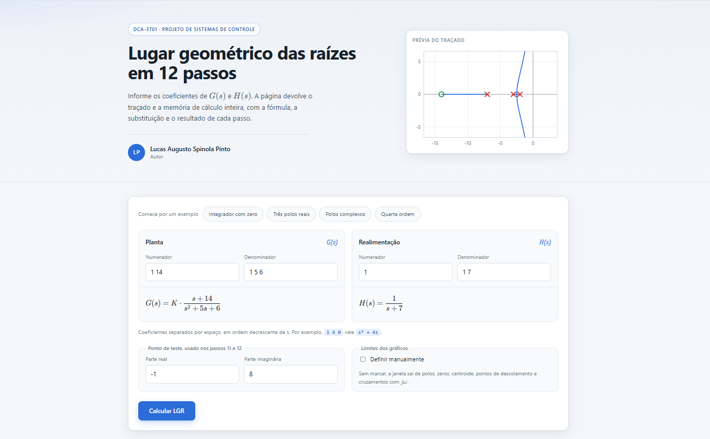
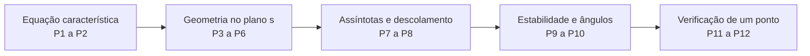

<div align="center" markdown="1">

# LGR em 12 passos

**Trace o lugar geométrico das raízes e veja a conta inteira, passo a passo.**

Informe G(s) e H(s) em coeficientes e a página percorre os doze passos clássicos do traçado,
mostrando a fórmula, a substituição e o resultado de cada um, com o plano s redesenhado a cada etapa.

### [Abrir a aplicação](https://lucasspinola.github.io/lgr-controle-dca3701/)

[Os 12 passos](#os-doze-passos) · [Estrutura](#estrutura-do-repositório) · [Rodar local](#começando) · [Testes](#testes)




**Lucas Augusto Spinola Pinto**

DCA-3701 Projeto de Sistemas de Controle<br>
Departamento de Engenharia de Computação e Automação · UFRN

</div>

---

Ferramenta de estudo para a disciplina DCA-3701, Projeto de Sistemas de Controle, da UFRN. Em vez
de devolver só o desenho final, ela abre cada um dos doze passos do roteiro de traçado, mostra a
fórmula, a substituição numérica e o resultado, e desenha o plano $s$ correspondente. Serve para
conferir exercício feito à mão, para estudar antes da prova e para entender por que o lugar tem a
forma que tem.

## O que a ferramenta faz

- **Mostra a conta, não só o gráfico:** cada passo traz a fórmula geral, a substituição com os
  valores do seu sistema e o resultado, tudo renderizado em LaTeX com KaTeX.
- **Doze passos independentes:** equação característica, forma fatorada, polos e zeros, segmentos
  do eixo real, lugares separados, simetria, assíntotas, pontos de descolamento, cruzamento com o
  eixo imaginário, ângulos de partida e chegada, critério de ângulo e critério de módulo.
- **Matemática implementada do zero:** raízes por Durand-Kerner com refinamento de Newton, tabela
  de Routh-Hurwitz simbólica em $K$ por aritmética de funções racionais, e varredura de $K$ com
  continuação entre amostras para manter cada ramo contínuo.
- **Gráficos com escala honesta:** todos os planos usam a mesma escala nos dois eixos, então
  ângulos de assíntota, arcos e simetrias aparecem com a geometria correta, e a janela é calculada
  a partir de polos, zeros, centroide, pontos de descolamento e cruzamentos com $j\omega$.
- **Funciona offline:** o KaTeX vem dentro do repositório, em `assets/vendor/`, então a página não
  depende de CDN nem de rede para renderizar as fórmulas.
- **Casos especiais de Routh:** pivô nulo com o resto da linha diferente de zero cai no método do
  épsilon, e linha inteiramente nula é substituída pela derivada do polinômio auxiliar. Os dois
  aparecem sinalizados no passo 9.
- **Link que reabre o exercício:** ao calcular, os coeficientes vão para a barra de endereços, e
  abrir esse link refaz a mesma análise.

## Os doze passos



| Passo | Tema | O que aparece |
|---|---|---|
| 1 | Equação característica | $G(s)H(s)$ montado e $D(s) + K \cdot N(s) = 0$ |
| 2 | Forma fatorada | $P(s)$ escrito em fatores |
| 3 | Polos e zeros | plano $s$ com $p_i$ e $z_j$ identificados |
| 4 | Segmentos no eixo real | regra do número ímpar e os intervalos resultantes |
| 5 | Lugares separados | $L_s = \max(n_p, n_z)$ |
| 6 | Simetria | por que o traçado é simétrico em relação ao eixo real |
| 7 | Assíntotas | número, centroide $\sigma_a$ e ângulos $\phi_a$, com a conta de cada $q$ |
| 8 | Descolamento | $dK/ds = 0$, derivadas, raízes e quais pertencem ao LGR |
| 9 | Cruzamento com $j\omega$ | tabela de Routh, condições de estabilidade, $K_{crit}$ e o método $s = j\omega$ |
| 10 | Partida e chegada | ângulo em cada polo e zero complexo, termo a termo |
| 11 | Critério de ângulo | soma dos ângulos no ponto de teste e veredito de pertinência |
| 12 | Critério de módulo | produto das distâncias e o valor de $K$ no ponto |

Depois dos doze passos vem o gráfico completo, com todos os ramos varridos de $K = 0$ até o ganho
em que o traçado já saiu da região de interesse.

## Estrutura do repositório

```
lgr-controle-dca3701/
├── index.html              página única da aplicação
├── assets/
│   ├── css/estilo.css      interface, planos e folha de impressão
│   ├── img/                marcas da UFRN e do DCA
│   ├── vendor/katex/       KaTeX embarcado, sem CDN
│   └── js/
│       ├── principal.js    ponto de entrada e orquestração
│       ├── nucleo/         complexos, polinômios, raízes e funções racionais
│       ├── analise/        as regras de traçado, uma por arquivo
│       ├── formatacao/     números e conversão para LaTeX
│       ├── grafico/        janela, plano SVG e camadas de desenho
│       └── interface/      apresentação, formulário e os doze passos
├── testes/
│   ├── executar.js         regras de traçado, Routh e janela dos gráficos
│   ├── raizes.js           raízes plantadas de grau 2 a 8 e resíduo
│   └── interface.js        os doze passos renderizados sobre um DOM falso
└── docs/assets/            imagens usadas neste README
```

A separação segue a direção de dependência: `nucleo` não conhece ninguém, `analise` usa `nucleo`,
`grafico` e `formatacao` só traduzem resultados, e `interface` é a única camada que toca o DOM.
Cada passo do roteiro é um módulo em `assets/js/interface/passos/`.

## Começando

A aplicação está publicada em
**[lucasspinola.github.io/lgr-controle-dca3701](https://lucasspinola.github.io/lgr-controle-dca3701/)**,
e não precisa de instalação nenhuma para usar.

Para rodar uma cópia local, note que a página usa módulos ES e precisa ser servida por HTTP. Abrir o
`index.html` direto do sistema de arquivos não funciona, porque o navegador bloqueia `import` em
`file://`.

```bash
git clone https://github.com/LucasSpinola/lgr-controle-dca3701.git
cd lgr-controle-dca3701

python -m http.server 8000
```

Depois abra <http://localhost:8000>. Se preferir Node:

```bash
npm start
```

Na página, informe os coeficientes de cada polinômio em ordem decrescente de $s$, separados por
espaço. Por exemplo, `1 4 0` é $s^2 + 4s$. Informe o ponto de teste usado nos passos 11 e 12 e
clique em **Calcular LGR**.

Depois de calcular, a barra de endereços passa a conter o exercício inteiro, no formato
`?ng=1&dg=1+3+2+0&nh=1&dh=1&re=-0.4226&im=0`. Abrir esse endereço refaz a análise sozinho, o que
serve para guardar um exercício ou mandar para alguém. Há ainda um botão para expandir todos os
passos de uma vez, um para baixar o gráfico final em SVG, e a folha de impressão abre os passos
e esconde o formulário quando você manda imprimir ou gerar PDF.

## Testes

São três suítes, todas em Node puro, sem dependências.

```bash
npm run teste
```

`executar.js` cobre as regras de traçado, a tabela de Routh com os casos especiais e o cálculo da
janela dos gráficos. `raizes.js` gera polinômios a partir de raízes conhecidas, de grau 2 a 8, e
confere se o solver as reencontra. `interface.js` monta um DOM falso e renderiza os doze passos
para seis sistemas diferentes, procurando exceções, `undefined` e `NaN` na saída.

## Publicação no GitHub Pages

O repositório já é um site estático. Em **Settings**, aba **Pages**, escolha **Deploy from a branch**,
selecione a branch `main` e a pasta `/ (root)`. O arquivo `.nojekyll` na raiz garante que o Jekyll
não interfira nos arquivos servidos.

## Licença

O código deste repositório está sob a licença MIT, descrita em [LICENSE](LICENSE). As marcas da
UFRN e do DCA em `assets/img/` pertencem às respectivas instituições e aparecem apenas para
identificar a disciplina.
